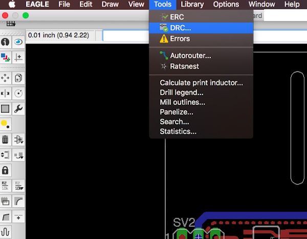
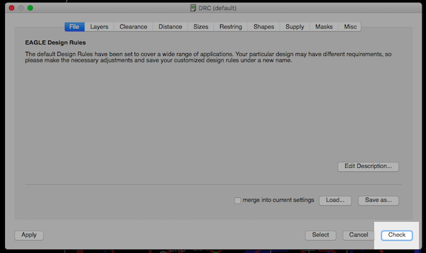
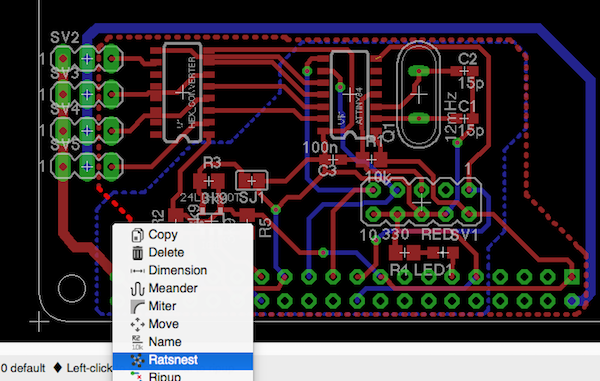
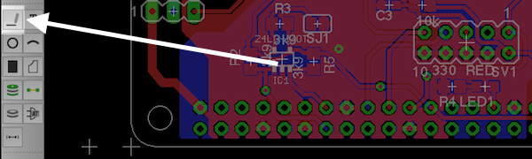

<!-- --- title: Using Fritzing with AISLER: Prepare your project for the Fab -->
# Prepare your project for the Fab #
Once your board is layed out, give it the last finishing checks before you submit it to AISLER. Already have everything covered, [skip to the next step](Upload-your-project-to-AISLER).

1. Prepare your project for the Fab
2. [[Uploading your project to AISLER|use-aisler-with/Autodesk-Eagle/Upload-your-project-to-AISLER]]
3. [[Document your parts (optional)|use-aisler-with/Autodesk-Eagle/Document-parts-in-AISLER]]
4. [[Holding your project in your hands|Holding-your-project-in-your-hands]]

### 1. Make a Design Rule Check (DRC) ###

Click **Tools > DRC**.

Download our design rule file for Eagle here:

- 2 Layer: [aisler_go_2layer.dru](assets/aisler_go_2layer.dru)

Select our design rule file and then click **Check**. The design rule check will then alert you about problematic areas that could break your circuit, for example traces that are too close together, overlaps, too little space to the side of the board, etc.

### 2. Fill up blank areas with copper (optional) ###

Right click on the area that needs to be filled and select **Ratsnest**. This should fill the required areas with copper.

**Note**: When you upload your design or your Gerbers they will always have a copper fill. So this step is for your illustration purposes only.

### 3. Make sure your board dimensions are lines

When you draw your board dimensions make sure they are lines not rectangles. Otherwise it will not be rendered or manufactured properly.

**Pro Tip**: If you are using a template, e.g. for an arduino shield, you should already be covered.

The next step: [[Uploading your project to AISLER|Upload-your-project-to-AISLER]]
