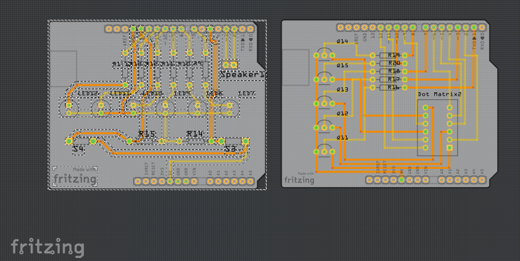
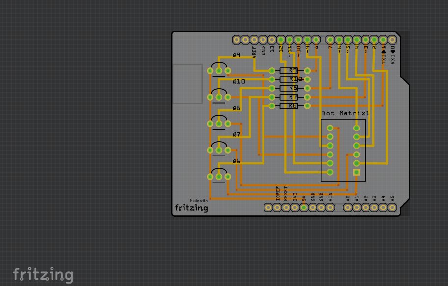

<!-- --- title: How to order a Sketch with more than one board -->
# How to order a Sketch with more than one board
Projects on AISLER are organized in repositories which contain one or more projects. As only on project at a time can be ordered we've to split up Fritzing Sketches with multiple boards.

## 1. Open the original Sketch

## 2. Select a single board to export
Next step is to select the board you would like to export. Using your mouse select the whole board and hit ⌘-C on Mac or Strg-C on Windows/Linux to copy.

## 3. Create new Sketch
Now create a new Sketch to paste the previously copied PCB to. Before you paste the board you have to remove the default board first.

Now paste the board using ⌘-V on Mac or Strg-V on Windows/Linux and save the Sktech.

## 4. Redo the process
Repeate this step for every single board.

## 5. Ready to go!
You can now upload all previously created Sketches to AISLER.

**Pro Tip:** Name the repository after your original Sketch and give the single PCBs distinctive names to recognize them later.
