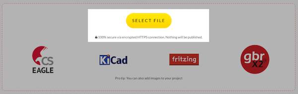
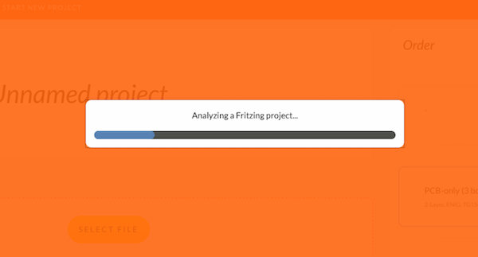
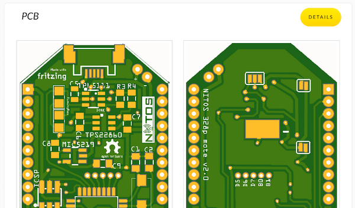
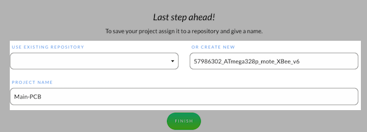

<!-- --- title: Using Fritzing with AISLER: Uploading your project to AISLER -->
# Uploading your project to AISLER #
This page tells you how you upload, validate and order your projectwith AISLER. We promise you will be able to get your project ready to order within one minute. -- if you already know how that stuff is done, [[skip to the next step|use-aisler-with/Fritzing/Document-parts-in-AISLER]].

0. [[The Basics|use-aisler-with/Fritzing/the-basics]]
1. [[Prepare your project for the Fab|use-aisler-with/Fritzing/Prepare-your-project-for-the-Fab]]
2. Uploading your project to AISLER
3. [[Documenting your parts (optional)|use-aisler-with/Fritzing/Document-parts-in-AISLER]]
4. [[Holding your project in your hands|use-aisler-with/Fritzing/Holding-your-project-in-your-hands]]

### 1. Start a new project ###

Click **Start New Project** in the top bar of the website. This link is available on any AISLER site.

**Pro Tip:** If you want to be quick, navigate to **[https://go.aisler.net/p/new](https://go.aisler.net/p/new)**. This will create a new project.

### 2. Upload your Fritzing file ###

You will then be redirected to a new Project Page. Click **Select File** and select your ** *.fzz ** File. Once you confirm the file dialog, AISLER will instantly start inspecting your file:

It may take up to 10 seconds to have your project analyzed.

**Attention:** At this moment we are not able to process Sketches that contain multiple pcb-boards.
[[Please follow these simple instructions to separate your boards|use-aisler-with/Fritzing/How-to-order-a-sketch-with-more-than-one-board]]

### 3. Proof your design (optional)

AISLER renders manufacturing images so that you can proof your design.

**Not happy with how things are rendered?** Repeat step 1 to 3 until you are. It doesn't cost anything to iterate, and it helps you get your project manufactured with ease.   

### 4. Setup a repository and project name ###

Just create or use an existing repository and create a new project. AISLER will try to suggest a name for you, but feel free to change it to match your flavor. This is the final step and you will have a documented project that you can let AISLER manufacture for you.

**Pro tip:** Your projects are organized just like git-repositories, so when you pick a repository and a project name, think of it this way. AISLER brings versioning out-of-the-box. So you won't need to open a new project for each iteration but rather upload a new version on the board's detail page.

### 5. Order your circuit board ###

Ordering your project is now as easy as a snap. Just look on the right, it's on the same page and the only thing you have to do is add your shipping address. Then just click **Pay Now** and you will be redirected to our payment provider **Mollie**.

We support the following payment types:

- Paypal
- Creditcard
- Bank transfer
- Bitcoin
- iDeal
- KBC/CBC, Belfius, and Bancontact
- Sofort Überweisung

Select your method of payment, and you will be redirected back to us.

This was it, now wait just 12 days and you will have your project in your hands.

Next step: [Documenting your parts (optional)](document-parts-in-aisler)
