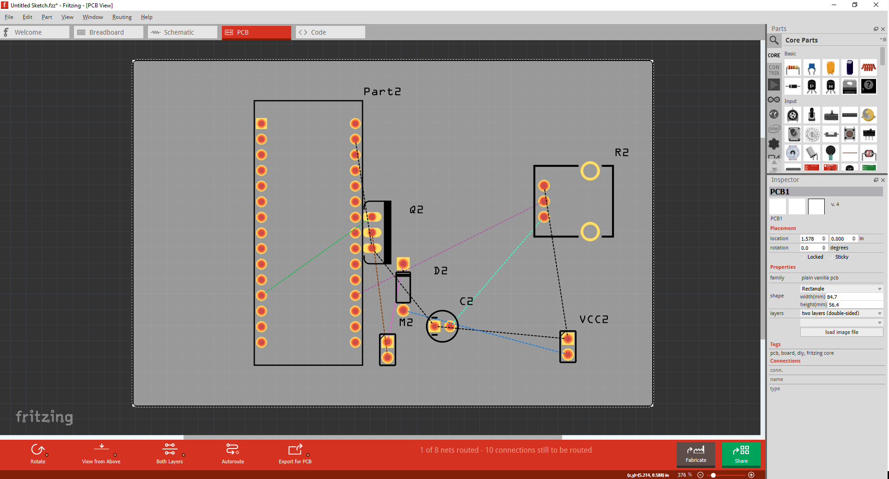
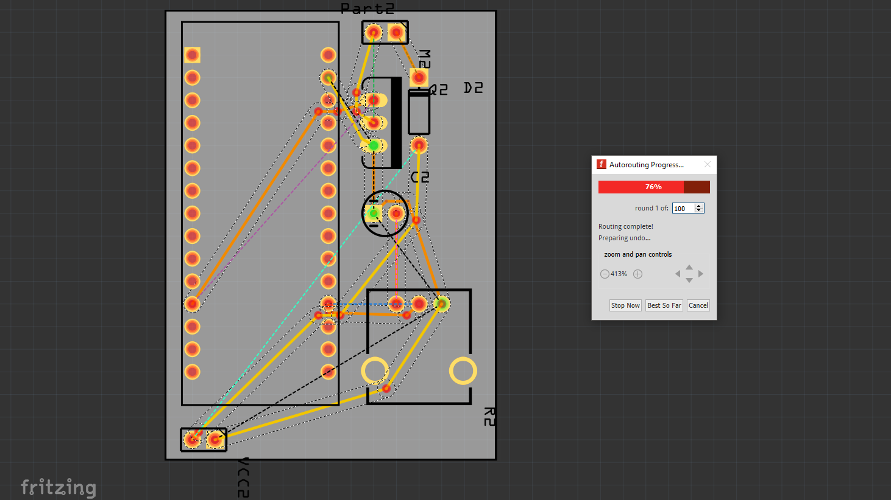
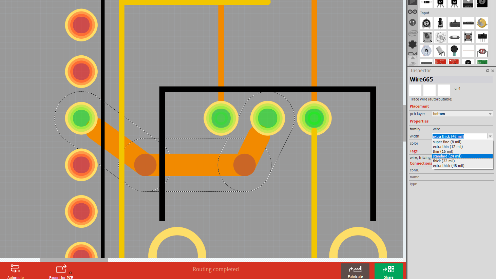

<!-- --- title: Using Fritzing with AISLER: the basics -->
# The Basics of PCB design #
This page tells you how to layout your board so that it can be produced by Fritzing Fab powered by AISLER. These are really just "best practice" suggestions -- if you're an advanced user, [[skip to the next step|use-aisler-with/Fritzing/Prepare-your-project-for-the-Fab]].

0. The Basics
1. [[Prepare your project for the Fab|use-aisler-with/Fritzing/Prepare-your-project-for-the-Fab]]
2. [[Uploading your project to AISLER|use-aisler-with/Fritzing/Upload-your-project-to-AISLER]]
3. [[Documenting your parts (optional)|use-aisler-with/Fritzing/Document-parts-in-AISLER]]
4. [[Holding your project in your hands|use-aisler-with/Fritzing/Holding-your-project-in-your-hands]]

**Pro Tip:** [[Prepare Multiboard fzz|use-aisler-with/Fritzing/How-to-order-a-sketch-with-more-than-one-board]]

### 1. Layout your PCB ###
Once you have created your circuit in Fritzing, go to "PCB" view to lay it out. If you are not familiar with this process, check out our [tutorial pages](http://fritzing.org/learning/tutorials/). Make sure you have [the latest version of Fritzing](http://fritzing.org/download) installed to reduce potential problems.

### 2. Save money by adjusting the board dimensions ###

The larger the board, the more it costs. Moving some parts around could save you real money. Keep it tight, but make sure you leave some space around the edges.

### 3. Route all traces ###

If you have a simple layout, try the auto-routing feature **(not recommended)** by clicking the symbol on the bottom toolbar. If the auto-router says »Routing completed«, go to the next step. If it doesn't, route the remaining traces by hand. Checkout [the Fritzing Docs](https://fritzing.github.io/fritzing-docs/01_quickstart/05_pcbview.html) for more Information about the pcb-view and routing.

### 4. Check trace dimensions ###

Check if the traces are thick enough. Some parts like motors, relays, batteries, strong lights will need »thick« or »extra thick« traces.
Rule: A big and short trace is better than a long and thin one. You can also type in a custom trace width.

### 5. Clean up funky routing ###

Sometimes, the auto-router produces strange traces. You can optimize them manually by moving or even removing bendpoints (double-click or right-click a bendpoint).

The next step: [Prepare your project for the Fab](Prepare-your-project-for-the-Fab).
